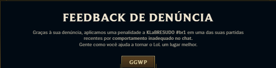

# ReportMyTeam

A League of Legends automation tool that monitors the game client and automatically reports all players at the end of every game — except players on your friends list, and you of course.

## Installation

### Option A: Pre-built executable

Download the latest `ReportMyTeam.exe` from the [Releases](../../releases) page. No dependencies required.

### Option B: Run from source

For this option, you need:
- Python 3.11+
- [uv](https://docs.astral.sh/uv/)

```bash
git clone https://github.com/levyvix/report-my-team
cd report-my-team
uv run report-my-team
```

## How it works

Once a game ends, the tool automatically submits reports for all non-friend players. Here's what the feedback looks like:


